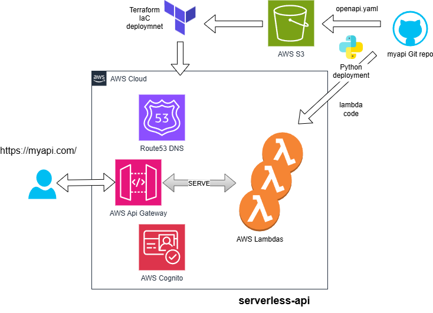

# aws-openapi

OpenAPI definitions for configuration-driven AWS APIs.



This repository is part of the [Adage](https://github.com/usekarma/adage) infrastructure framework. It defines REST API contracts consumed by the [`serverless-api`](https://github.com/usekarma/aws-iac/tree/main/components/serverless-api) Terraform component.

---

## Purpose

* Define REST APIs declaratively using OpenAPI 3.x
* Keep API definitions in Git for versioning and review
* Decouple API contracts from Lambda logic and deployment state

---

## OpenAPI Extensions

Each operation in the OpenAPI spec includes the custom extension `x-lambda-nickname`, which identifies the Lambda that should handle the request:

```yaml
paths:
  /echo:
    post:
      summary: Echo the posted JSON back
      x-lambda-nickname: echo
```

* The path (e.g., `/echo`) does not need to match the Lambda nickname.
* `x-lambda-nickname` must correspond to a directory under `/lambdas/`.
* During deployment, the nickname is resolved to a Lambda function ARN by looking up:

  ```
  /iac/lambda/<nickname>/runtime
  ```

This decouples the OpenAPI spec from hardcoded ARNs and supports environment-specific resolution. It always invokes `$LATEST`.

---

## Directory Structure

```
aws-openapi/
├── openapi/
│   └── demo-api/
│       └── openapi.yaml          # OpenAPI 3.0 spec
│
├── lambdas/
│   ├── echo/
│   │   ├── main.py
│   │   └── requirements.txt      # Optional
│   ├── status/
│   │   ├── main.py
│   │   └── requirements.txt
│   └── time/
│       ├── main.py
│       └── requirements.txt
│
└── scripts/
    ├── deploy_lambda.py
    └── deploy_openapi.py
```

* `openapi.yaml` defines the API
* Lambda directories implement handlers referenced by `x-lambda-nickname`

---

## Deployment

### OpenAPI Deployment

```bash
python scripts/deploy_openapi.py demo-api
# writes /iac/openapi/demo-api/runtime to SSM
```

* Uploads the OpenAPI file to the `demo-api` S3 bucket
* Stores the object URL in Parameter Store for use by `serverless-api`

### Lambda Deployment

```bash
python scripts/deploy_lambda.py echo
# writes /iac/lambda/echo/runtime to SSM
```

* Packages the Lambda source code
* Publishes it to AWS Lambda
* Records the **unversioned function ARN** (invokes `$LATEST`) in Parameter Store

---

## Requirements

* Python 3.10+
* AWS credentials (e.g., via `AWS_PROFILE`)
* Python packages:

```bash
pip install -r scripts/requirements.txt
```
